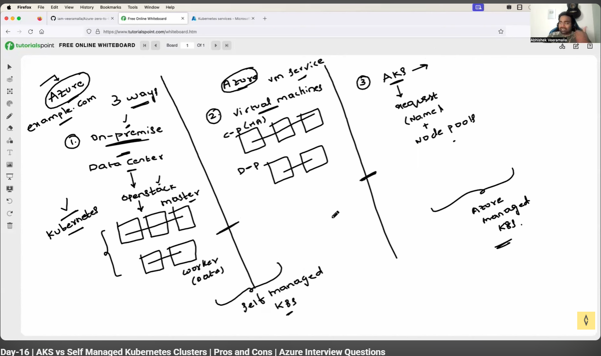
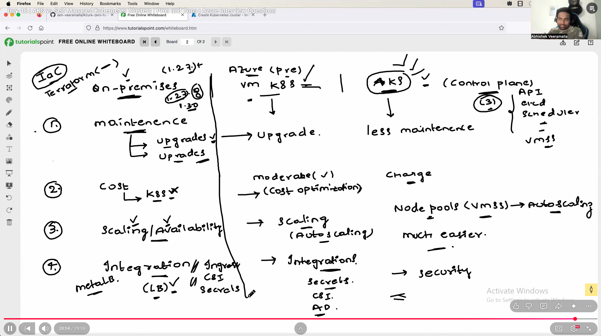

# Azure Kuberenetes Service 

## When should we use aks service, on premise and virtual machine (means installing K8s in Vm's)

### On-Premise 

- **Maintance**

   If we are setting K8s cluster in on prem, then we have do maintaince with respective  upgrades. We have to timely update. and node upgrade 

**Cost**

If the using on prem and no resouces are utilized . So, In Such case cost wil be less. And if we dont have on-prem setup and setting al newly this wil cost more.

### virtual machineS

- Here also same as on prem, we have check the updates but for nodes azure will be taking care. 

**Cost**

- Cost is moderate.

### AKS

- Less maintance 

- Here cost will be pay as you go.

- AKS comes with managed control plane 

- Security will be low. 

