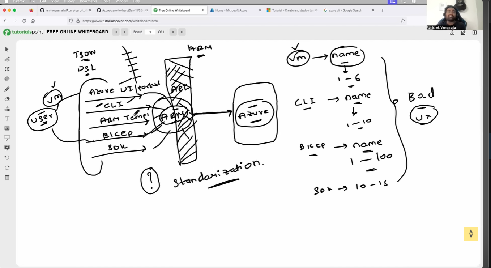
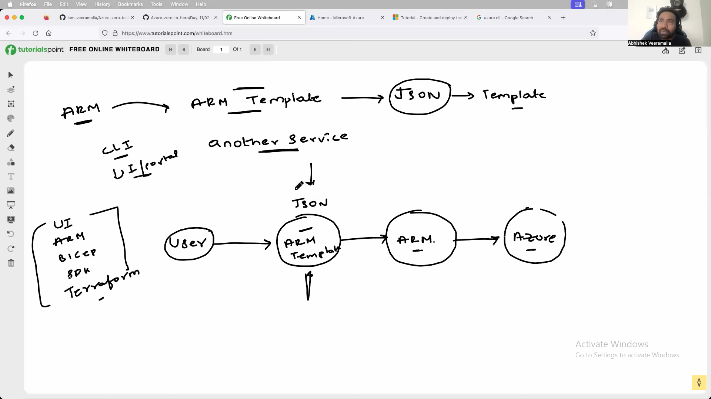

# ARM





- For creating the resources in Azure we can use AZure UI, bicep, ARM template, CLI. So, in this ARM comes into picture it acts as bridge b/w AZure UI, bicep, ARM template, CLI to Azure. for making the standardizaion.

- standardizaion means the azure resources should not be in exsisted the charecter.  




## Functions

- it is used for custimize and generate dyanamic output.

EX - If we hard code the values of services nxt this templates cnt be used again. in this case we will use functions.


- To write an ARM template we need have some basic fields schema, contentVersion, parameters, variables, resources and outputs. 


```
{
  "schema": "https://schema.management.azure.com/schemas/2015-01-01/deploymentTemplate.json#",
  "contentVersion": "1.0.0.0",
  "parameters": { },
  "variables": { },
  "resources": [ ],
  "outputs": { }
}
```

## schema

Which ARM template format and rules should be used to validate this JSON file

- Helps Azure validate your template syntax
- Enables IntelliSense/autocomplete in VS Code
- Ensures correct ARM structure
- Detects errors before deployment


## variables

- Instead of writing the same value multiple times, you store it once and reuse it

**Benefits**

- Reduces repeated code
- Easier to manage
- Improves readability
- Centralized changes


## parameters

The parameters section is used to take input values from the user during deployment.

**Why Parameters are Used**

Instead of hardcoding values inside the template, parameters make templates reusable.

**Example:**

VM Name
Storage Account Name
Username
Password
Location

```
"parameters": {
    "storageAccountName": {
        "type": "string"
    }
}
```

```
"parameters": {
    "vmName": {
        "type": "string"
    },
    "adminUsername": {
        "type": "string"
    },
    "adminPassword": {
        "type": "secureString"
    }
}
```


## resources

- The resources section is the most important part of an ARM template.

**Examples:**

Virtual Machine
Storage Account
VNet
NSG
Load Balancer
SQL Database


```
"resources": [
   {
      resource1
   },
   {
      resource2
   }
]

```

### Example — Storage Account

```
"resources": [
  {
    "type": "Microsoft.Storage/storageAccounts",
    "apiVersion": "2023-01-01",
    "name": "mystorage123",
    "location": "Central India",
    "sku": {
      "name": "Standard_LRS"
    },
    "kind": "StorageV2",
    "properties": {}
  }
]
```


### Important Fields Inside Resources

# Important Fields Inside Resources

| Field | Meaning |
|---|---|
| `type` | Azure resource type |
| `apiVersion` | Resource API version |
| `name` | Resource name |
| `location` | Azure region |
| `properties` | Configuration settings |
| `dependsOn` | Resource dependency |
| `sku` | Pricing/performance tier |


| ARM Section | Real World             |
| ----------- | ---------------------- |
| Parameters  | User choices           |
| Variables   | Internal labels        |
| Resources   | Actual rooms/buildings |
| Outputs     | Final details shown    |


Difference b/w ARM template, Bicep, CLI and Terraform 


- If the orginization based on Azure we can use ARM or Terraform. json format. 

- bicep used DSL language it is Domain Specific lang. 