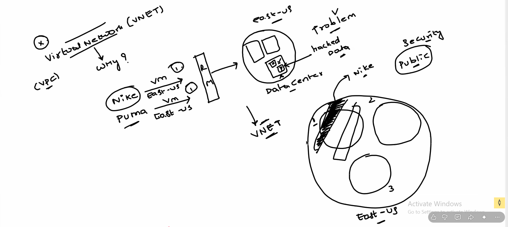
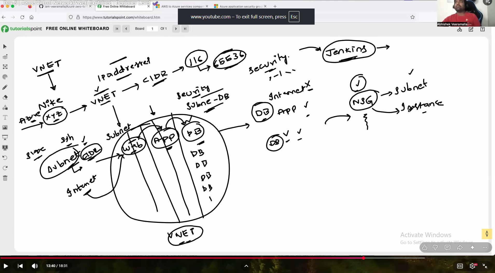
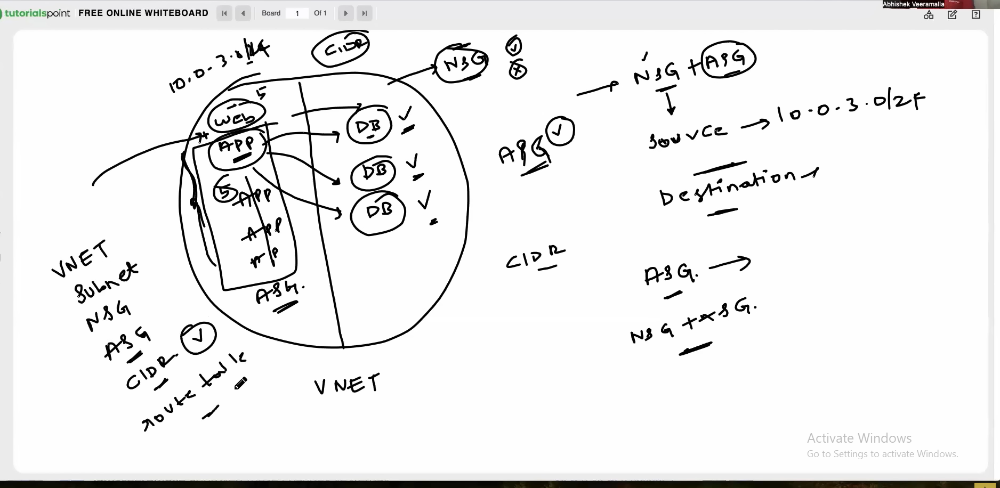
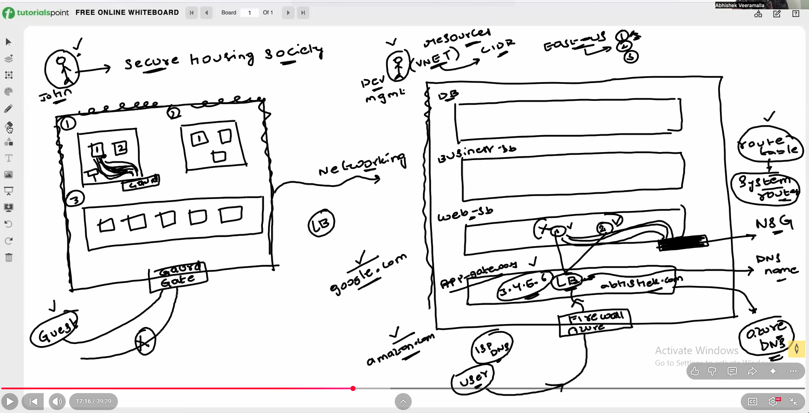
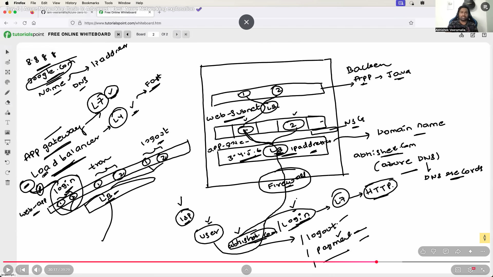
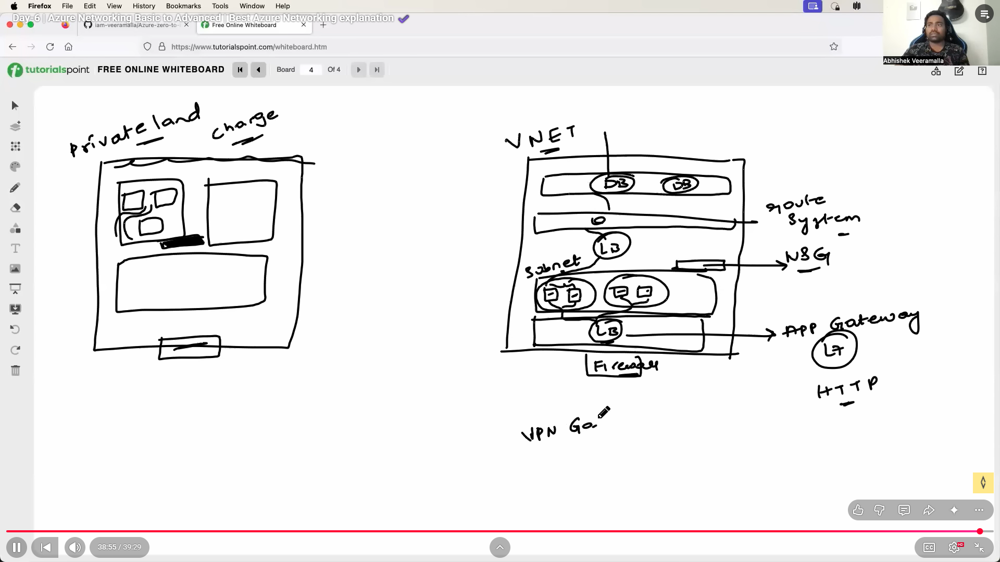

# Azure Networking

## Virtual Network

A Virtual Network (VNet) in Azure is a logically isolated network that securely connects Azure resources and extends on-premises networks. Key features include:

- Isolation: VNets provide isolation at the network level for segmenting resources and controlling traffic.

- Subnetting: Divide a VNet into subnets for resource organization and traffic control.

- Address Space: VNets have an address space defined using CIDR notation, determining the IP address range.

## Subnets, CIDR

### Subnets
Subnets are subdivisions of a Virtual Network, allowing for better organization and traffic management.

### CIDR (Classless Inter-Domain Routing)
CIDR notation represents IP addresses and their routing prefix, specifying the range of IP addresses for a network.

## Routes and Route Tables

### Routes

Routes dictate how network traffic is directed, specifying the destination and next hop.

### Route Tables

Route Tables are collections of routes associated with subnets, enabling custom routing rules.

## Network Security Groups (NSGs)

NSGs are fundamental for Azure's network security, allowing filtering of inbound and outbound traffic. Key aspects include:

**Rules** : NSGs define allowed or denied traffic based on source, destination, port, and protocol.

**Default Rules**: NSGs have default rules for controlling traffic within the Virtual Network and between subnets.

**Association** : NSGs can be associated with subnets or individual network interfaces.

## Application Security Groups (ASGs)

ASGs group Azure virtual machines based on application requirements, simplifying network security:

**Simplification**: ASGs allow defining rules based on application roles instead of individual IP addresses.

**Dynamic Membership**: ASGs support dynamic membership based on tags or other attributes.

**Rule Association**: Security rules can be associated with ASGs for intuitive and scalable network security management.

# DAY -06

# Azure Networking Advanced

## Azure App Gateway & WAF

Azure Application Gateway is a web traffic load balancer that enables you to manage and route traffic to your web applications. Web Application Firewall (WAF) provides protection against web vulnerabilities. Key features include:

Load Balancing: Distributes incoming traffic across multiple servers to ensure no single server is overwhelmed.

SSL Termination: Offloads SSL processing, improving the efficiency of web servers.

Web Application Firewall (WAF): Protects web applications from common web vulnerabilities and exploits.

## Azure Load Balancer

Azure Load Balancer distributes incoming network traffic across multiple servers to ensure no single server is overwhelmed. Key features include:

Load Balancing Algorithms: Supports different algorithms for distributing traffic, such as round-robin and least connections.

Availability Sets: Works seamlessly with availability sets to ensure high availability.

Inbound and Outbound Traffic: Balances both inbound and outbound traffic.

## Azure DNS

Azure DNS is a scalable and secure domain hosting service. It provides name resolution using the Microsoft Azure infrastructure. Key features include:

Domain Hosting: Hosts domain names and provides name resolution within Azure.

Integration with Azure Services: Easily integrates with other Azure services like App Service and Traffic Manager.

Global Availability: Provides low-latency responses globally.

## Azure Firewall

Azure Firewall is a managed, cloud-based network security service that protects your Azure Virtual Network resources. Key features include:

Stateful Firewall: Allows or denies traffic based on rules and supports stateful inspection.

Application FQDN Filtering: Filters traffic based on fully qualified domain names.

Threat Intelligence Integration: Integrates with threat intelligence feeds for enhanced security.

## Virtual Network Peering and VNet Gateway

**Virtual Network Peering**

Virtual Network Peering allows connecting Azure Virtual Networks directly, enabling resources in one VNet to communicate with resources in another. Key features include:

Global VNet Peering: Peering can be established across regions.

Transitive Routing: Traffic between peered VNets flows directly, improving performance.

**VNet Gateway**
VNet Gateway enables secure communication between on-premises networks and Azure Virtual Networks. Key features include:

Site-to-Site VPN: Connects on-premises networks to Azure over an encrypted VPN tunnel.

Point-to-Site VPN: Enables secure remote access to Azure resources.

## VPN Gateway

Azure VPN Gateway provides secure, site-to-site connectivity between your on-premises network and Azure. Key features include:

IPsec/IKE VPN Protocols: Ensures secure communication over the Internet.

High Availability: Supports active-active and active-passive configurations for high availability.

BGP Support: Allows dynamic routing between your on-premises network and Azure.

