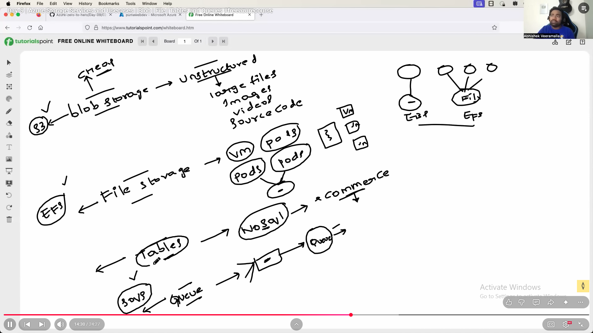

# Azure Blob Storage

## What is it?

- Azure Blob Storage is a cloud-based object storage solution provided by Microsoft Azure. It is designed to store and manage large amounts of unstructured data, such as documents, images, videos, and other types of binary and text data. Blobs are organized into containers, and each blob is assigned a unique URL for access.

## When to use it?

- Use Azure Blob Storage when you need to store and retrieve large amounts of unstructured data. It is suitable for scenarios like serving images or videos to a website, storing backups, and handling data for analytics and big data processing.

## Example from DevOps Engineer point of view?

- A DevOps engineer may use Azure Blob Storage to store artifacts and binaries produced during the build process, ensuring a centralized and scalable storage solution. Azure Storage Explorer or Azure CLI can be used to automate the uploading and retrieval of artifacts during deployment pipelines.

- WE can store unstructured data, large files, images, videos, source code, html files and python code.  

## Equivalent service in AWS:

- The equivalent service in AWS is Amazon Simple Storage Service (S3). S3 is also an object storage service designed for scalable and secure storage of objects, such as files and data.

# Azure File Storage

## What is it?

- Azure File Storage is a fully managed file share service in the cloud. It provides the Server Message Block (SMB) protocol for sharing files across applications and VMs in the Azure cloud. Azure File Storage is useful for applications that require shared file access, such as configuration files or data files.

## When to use it?

- Use Azure File Storage when you need a shared file system that can be accessed from multiple VMs or applications. It is suitable for scenarios like storing configuration files, sharing data between applications, and serving as a common storage location for applications in a cloud environment.

- It is used when ever we want to share the file storage to mutiple vm's or k8s pods.

- If there is some it shoud access by mutiple pods.

## Example from DevOps Engineer point of view?

- A DevOps engineer may leverage Azure File Storage to store configuration files that are shared among multiple application instances. In a deployment pipeline, scripts or configuration files stored in Azure File Storage can be mounted to VMs or containers during the deployment process.

## Equivalent service in AWS:

- The equivalent service in AWS is Amazon Elastic File System (EFS). EFS provides scalable file storage for use with Amazon EC2 instances, supporting the Network File System (NFS) protocol.

# Azure Tables

## What is it?

Azure Tables is a NoSQL data store service provided by Azure. It stores large amounts of semi-structured data and allows for fast and efficient querying using a key-based access model. Data is organized into tables, and each table can store billions of entities.

## When to use it?

Use Azure Tables when you need a highly scalable NoSQL data store for semi-structured data with simple key-based access. It is suitable for scenarios like storing configuration data, user profiles, and other data where a key-value or key-attribute data model is appropriate.

## Example from DevOps Engineer point of view?

A DevOps engineer may use Azure Tables to store configuration settings for applications or services. During the deployment process, scripts can retrieve configuration data from Azure Tables to customize the behavior of deployed applications.

## Equivalent service in AWS:

While AWS does not have a direct equivalent service for Azure Tables, Amazon DynamoDB is a similar NoSQL database service that provides key-value and document storage. DynamoDB can be used for similar use cases.

# Azure Queue Storage

## What is it?

Azure Queue Storage is a message queue service that allows decoupling of components in a distributed application. It provides a reliable way to store and retrieve messages between application components, ensuring asynchronous communication.

## When to use it?

Use Azure Queue Storage when you need to enable communication and coordination between different parts of a distributed application. It is suitable for scenarios like handling background jobs, managing tasks asynchronously, and facilitating communication between loosely coupled components.

## Example from DevOps Engineer point of view?

A DevOps engineer may use Azure Queue Storage to implement a message queue for processing background tasks or managing communication between microservices. During deployment, scripts can enqueue messages to trigger specific actions or coordinate tasks between different components.

## Equivalent service in AWS:

The equivalent service in AWS is Amazon Simple Queue Service (SQS). SQS provides a fully managed message queue service for decoupling components in a distributed system.

