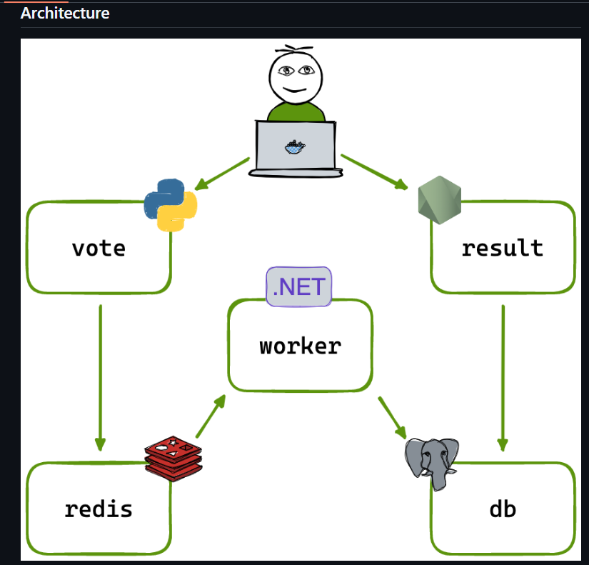
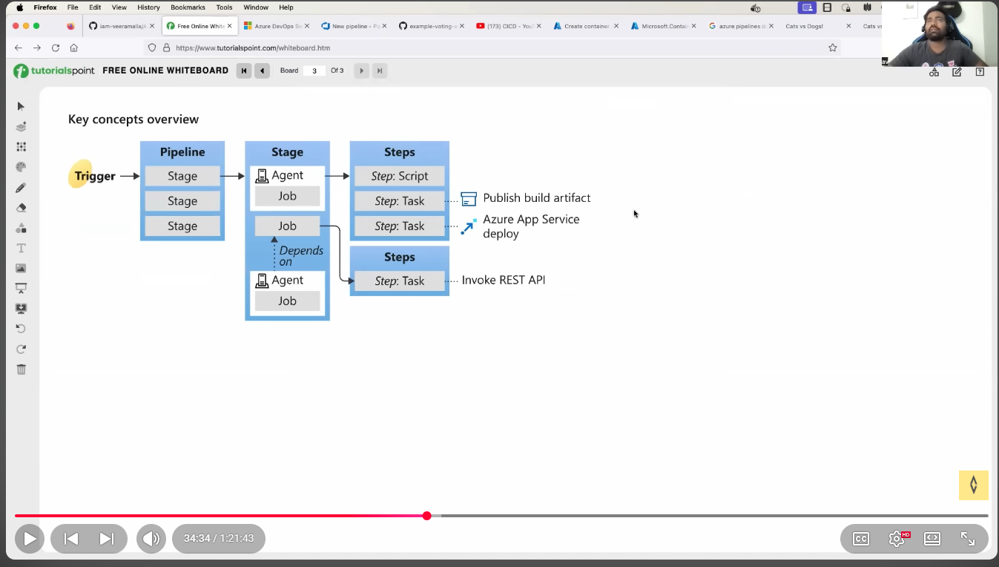
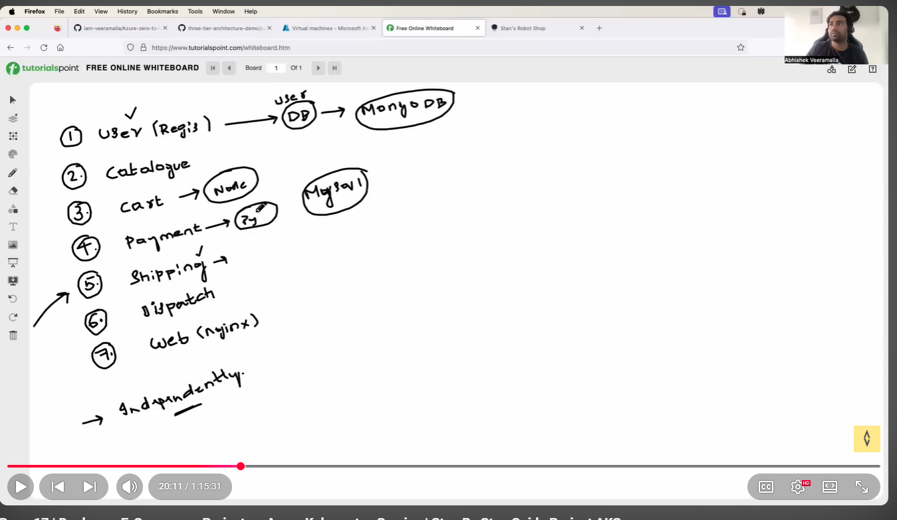
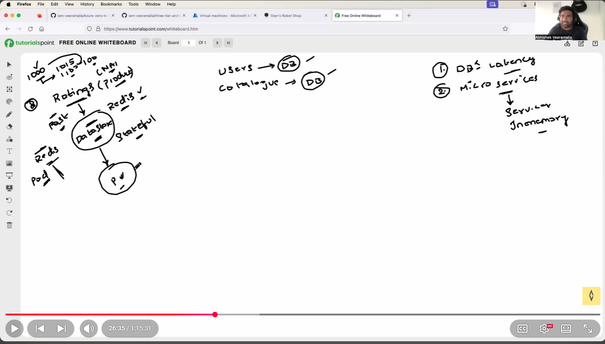
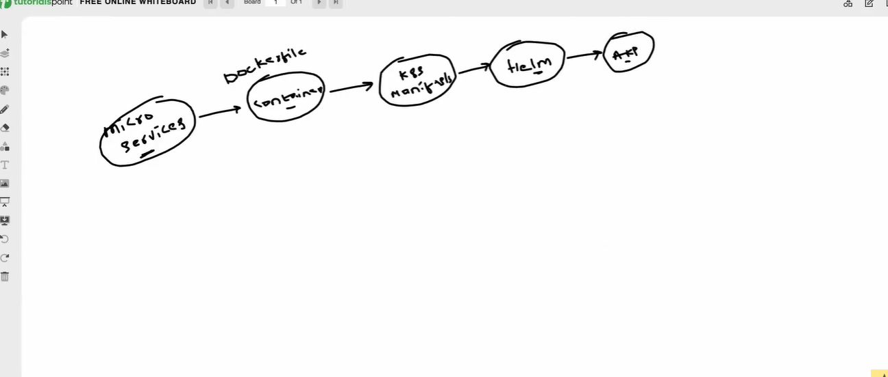
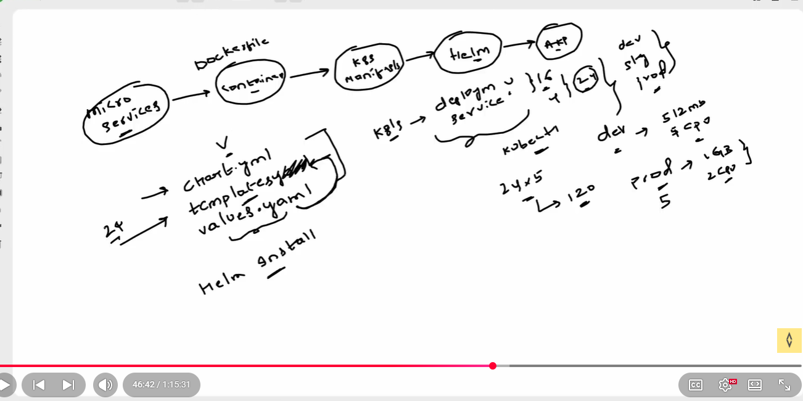
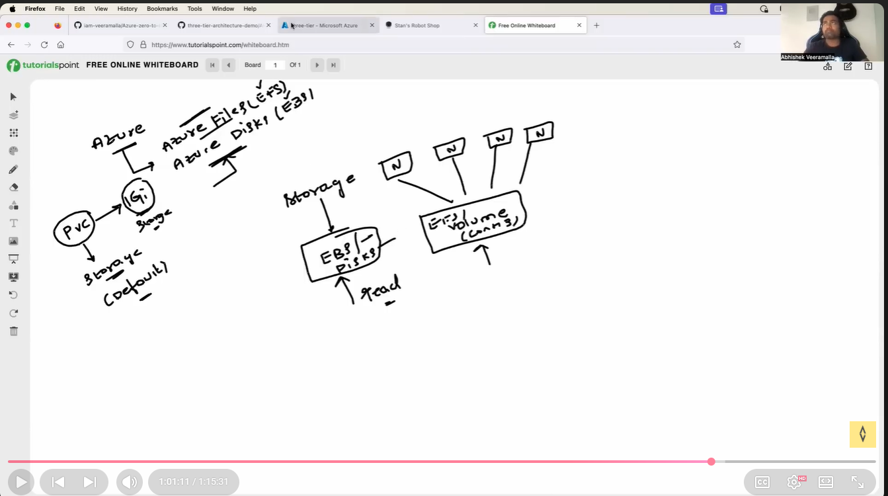

## Architecture

# Deploying a Three Tier application E-Commerce ( 8 Services, 2 Data bases) on AKS.

## commands

- kubectl config get-contexts

- for switching  to aks nd minikue

the kubectl config use-context three-tier

- kubectl create ns robot-shop

- helm install robot-shop --namespace robot-shop .

- kubectl get storageclass

-  kubectl get pods -n robot-shop

- kubectl describe pod redis-0 -n robot-shop

- kubectl get svc

## when to use PVS and azure storage 

- if storage acccessed  single pod use EBS or Azure disk 

- if your volume accessed y multiple containers accross diff. multiple nodes use EFS  or Azure files. 

